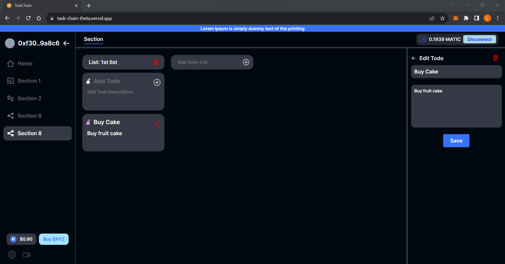

# TaskChain - Decentralized To-Do Web App

TaskChain is a decentralized to-do web app built with Next.js, TypeScript, and Redux. It leverages the power of blockchain technology to provide a secure and transparent task management solution.

## Features

- **Decentralized Task Management**: TaskChain utilizes blockchain technology to decentralize task storage and ensure data integrity and resilience.
- **Create and Organize Tasks**: Easily create, organize, and prioritize your tasks in an intuitive user interface.
- **Synchronization Across Devices**: Enjoy seamless synchronization of your tasks across multiple devices, allowing you to stay productive anytime, anywhere.
- **Secure and Transparent**: TaskChain ensures the utmost security and transparency in task management by leveraging the benefits of blockchain technology.
- **User-Friendly Interface**: Experience a seamless user interface with intuitive navigation, making task management a breeze.

## Technologies Used

- Next.js: A powerful React framework for building server-side rendered and static websites.
- TypeScript: A statically typed superset of JavaScript that enhances code reliability and maintainability.
- Redux: A predictable state container for managing application state.
- Blockchain Technology: TaskChain utilizes blockchain technology for decentralized task storage and data integrity.

## Getting Started

Follow the instructions below to get a local copy of TaskChain up and running on your machine.

### Prerequisites

- Node.js (v12 or higher)
- npm (v6 or higher)

### Installation

1. Clone the repository: `git clone https://github.com/your-username/taskchain.git`
2. Navigate to the project directory: `cd taskchain`
3. Install the dependencies: `npm install`

### Running the App

1. Start the development server: `npm run dev`
2. Open your browser and access TaskChain at `http://localhost:3000`

## Contributing

Contributions are welcome! If you'd like to contribute to TaskChain, please follow these steps:

1. Fork the repository.
2. Create a new branch for your feature: `git checkout -b feature-name`
3. Make your changes and commit them: `git commit -m 'Add some feature'`
4. Push the changes to your forked repository: `git push origin feature-name`
5. Submit a pull request to the main repository.

## License

TaskChain is released under the [MIT License](LICENSE).

## Contact

If you have any questions or suggestions, feel free to reach out to our team at [contact@taskchain.com](mailto:contact@taskchain.com).

Visit our website: [www.taskchain.com](https://www.taskchain.com)
